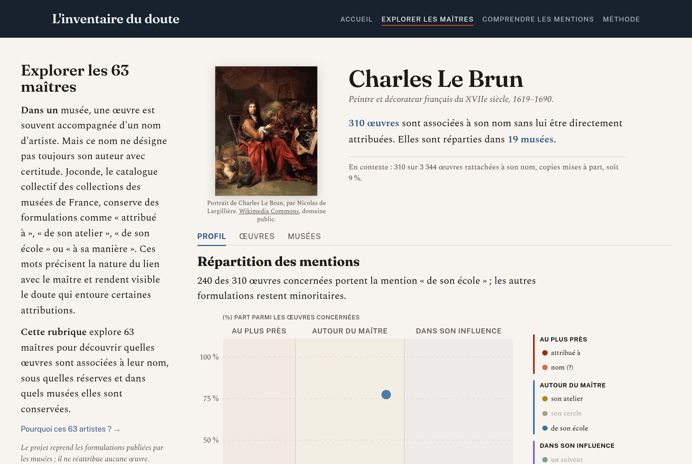
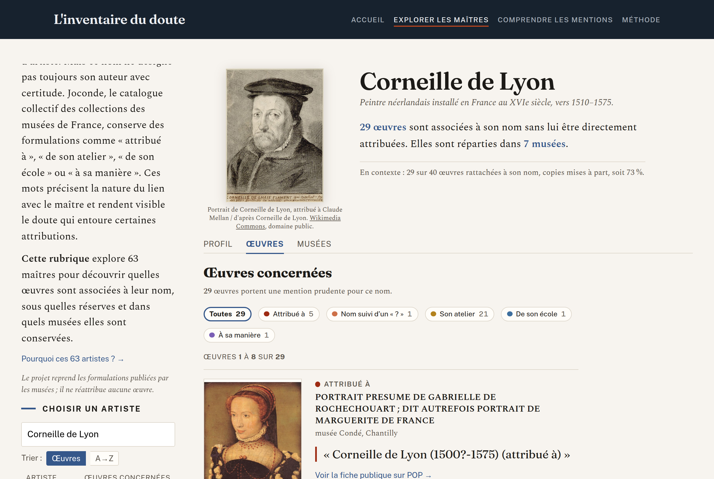
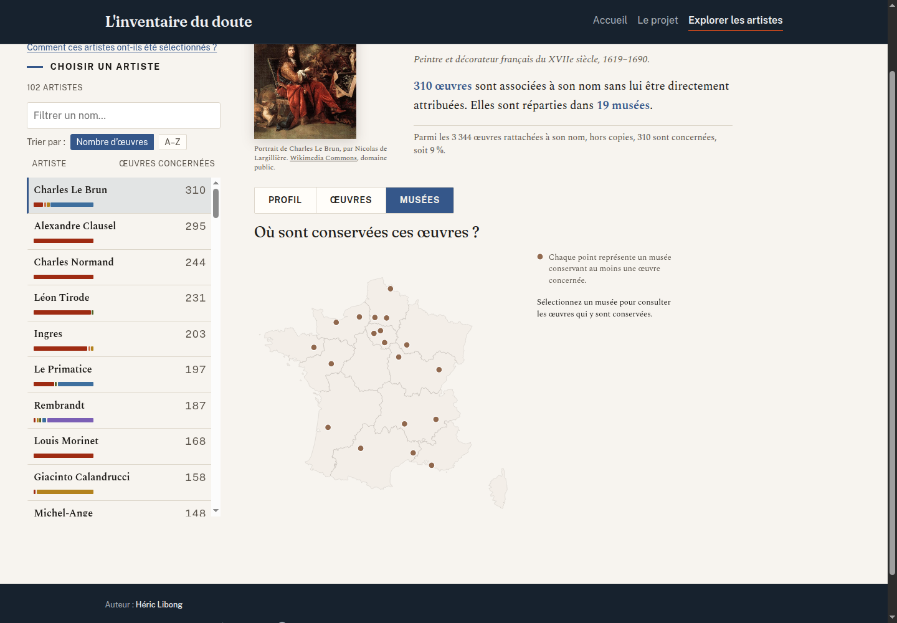

# L'inventaire du doute

**Volume 1 — Autour des maîtres**

L'inventaire du doute est un **site éditorial de données interactif** consacré aux
incertitudes d'attribution publiées par les musées de France. Ce premier volume permet
d'explorer ces réserves à partir de 102 artistes : les formulations employées, les œuvres
concernées et les musées qui les conservent.

[Voir le site](https://hericlibong.github.io/inventaire-du-doute/) ·
[Explorer les artistes](https://hericlibong.github.io/inventaire-du-doute/artistes/) ·
[Lire la méthode](https://hericlibong.github.io/inventaire-du-doute/methode/)

## Le projet

La base [Joconde](https://www.data.gouv.fr/fr/datasets/collections-des-musees-de-france-base-joconde/)
est le catalogue collectif des collections des musées de France. Dans sa version du
**1er juillet 2026**, elle réunit **1 023 705 notices**. Parmi elles, **24 507**, soit
**2,4 %**, indiquent une incertitude ou une réserve sur l'auteur d'une œuvre.

Ces informations existent dans les notices, mais elles restent difficiles à observer dans
leur ensemble. Le projet les repère, les classe et les rassemble sans chercher à
authentifier ni à réattribuer les œuvres.

Le premier volume suit un angle précis : les artistes dont le nom revient dans au moins dix
notices exprimant une réserve sur l'auteur. Après regroupement des graphies et vérification
des identités, il réunit :

- **102 artistes** ;
- **6 081 notices Joconde distinctes** ;
- **8 formulations** regroupées en trois territoires de lecture ;
- **24,8 %** des notices prudentes repérées dans l'ensemble de Joconde.

Ce périmètre n'est donc pas un inventaire exhaustif du doute dans les collections
françaises. C'est le premier angle d'exploration d'un phénomène plus large.

## Ce que le site permet de faire

- comprendre qu'un nom associé à une œuvre peut désigner un auteur possible, un atelier,
  une école ou une influence ;
- comparer la répartition des formulations autour d'un artiste ;
- parcourir toutes les œuvres concernées et les filtrer par mention ou par musée ;
- repérer les établissements qui les conservent sur une carte ;
- revenir aux notices originales publiées sur POP ;
- constituer un point de départ pour une recherche, une médiation ou un enseignement.

Une œuvre n'a pas besoin d'avoir un auteur parfaitement identifié pour avoir une histoire,
une valeur artistique et une place dans un musée. L'incertitude sur son attribution
n'enlève rien à son existence, à son intérêt ni à sa valeur patrimoniale.

## Trois vues pour chaque artiste

### Profil

Le graphique place les huit formulations sur une même échelle. Sa hauteur représente leur
fréquence parmi les œuvres concernées, jamais un degré de certitude.

### Œuvres

La liste restitue la formulation publiée par le musée. Elle peut être filtrée par famille
d'attribution et par établissement. Lorsqu'une reproduction réutilisable a pu être reliée
avec certitude à la notice, elle peut être examinée en grand.

### Musées

Chaque point représente un musée conservant au moins une œuvre concernée. La carte est un
repère géographique, pas un classement des établissements.

## Méthode

L'unité de calcul est la **notice Joconde**, identifiée par sa référence. Une même référence
n'est comptée qu'une fois dans le profil d'un artiste, même si son champ auteur contient
plusieurs mentions qui le concernent.

Les principales règles sont les suivantes :

- les formulations sont détectées dans le champ auteur, puis rattachées à huit familles ;
- les différentes graphies d'un nom sont regroupées après vérification de l'identité ;
- les homonymes sont séparés et les noms insuffisamment identifiables restent hors du
  corpus publié ;
- lorsqu'une notice porte plusieurs formulations pour le même artiste, une priorité
  documentée évite le double comptage dans son profil ;
- les copies signalées par « d'après » sont comptées à part : elles décrivent un statut de
  copie, pas une hésitation sur l'auteur ;
- les comptages nationaux et les profils d'artistes répondent à des unités différentes,
  expliquées dans la page Méthode.

La méthode complète, les références officielles, les cas particuliers et les limites sont
publiés sur la page [Méthode et limites](https://hericlibong.github.io/inventaire-du-doute/methode/)
et complétés par [`docs/methode-et-limites.md`](docs/methode-et-limites.md).

## Images

Les données descriptives de Joconde sont ouvertes, mais cela ne donne pas automatiquement
le droit de réutiliser les photographies associées aux notices POP.

Le site n'affiche donc que des fichiers dont le statut a été vérifié individuellement. À ce
jour, il comprend :

- **209 reproductions d'œuvres** : 195 provenant de Wikimedia Commons et 14 de Gallica ;
- **73 portraits d'artistes** provenant de Wikimedia Commons.

Chaque fichier est conservé localement avec sa source, son crédit et sa licence. Une
reproduction n'est retenue que si sa correspondance avec la notice Joconde est établie ;
une ressemblance de titre ou de dimensions ne suffit pas.

## Limites

- Joconde est alimentée volontairement par les musées : les versements sont incomplets et
  inégaux.
- Le projet décrit ce que les musées ont publié à une date donnée ; il ne mesure pas toutes
  les incertitudes présentes dans les collections françaises.
- Les chiffres ne permettent pas de comparer la qualité du travail des musées.
- Le projet ne détermine pas l'auteur véritable des œuvres et n'émet aucun avis sur leur
  attribution ou leur valeur marchande.
- L'absence de reproduction indique une limite de réutilisation ou de correspondance, pas
  l'absence d'une image dans la notice originale.

## Architecture

- **Pipeline Python** (`src/`, pandas, `uv`) : lecture du CSV Joconde, détection,
  désambiguïsation, classification et exports JSON.
- **Site SvelteKit statique** (`web/`, Svelte 5) : interface éditoriale, datavisualisations
  SVG et carte avec D3-geo.
- **Données publiées** (`data/exports/web/`) : exports légers versionnés ; le CSV source
  d'environ 1,1 Go n'est pas inclus dans le dépôt.
- **Documentation** (`docs/`) : méthode, décisions, journal de travail et limites.
- **Déploiement** (`.github/workflows/pages.yml`) : build statique et publication sur
  GitHub Pages.

Le navigateur ne charge jamais la base Joconde complète et aucun serveur applicatif n'est
nécessaire en production.

## Structure du dépôt

| Chemin | Contenu |
|---|---|
| `src/` | Pipeline de traitement et de classification |
| `tests/` | Tests Python du pipeline et des invariants d'export |
| `data/exports/` | Résultats, audits et exports web versionnés |
| `web/` | Site SvelteKit et tests front |
| `docs/` | Méthode, décisions, journal et documentation éditoriale |
| `.github/workflows/` | Publication GitHub Pages |

## Auteur

**Héric Libong**

[hericlibong@gmail.com](mailto:hericlibong@gmail.com) ·
[Site web](https://hericlibong.github.io/) ·
[GitHub](https://github.com/hericlibong)

## Données, crédits et licences

- **Données Joconde** : ministère de la Culture,
  [Licence Ouverte 2.0](https://www.data.gouv.fr/pages/legal/licences/etalab-2.0).
- **Fond cartographique** : ADMIN EXPRESS COG 2018, IGN,
  Licence Ouverte / Etalab.
- **Images** : domaine public, Creative Commons ou conditions de réutilisation indiquées
  sous chaque fichier ; les crédits et liens de source sont affichés dans le site.
- **Code et contenus éditoriaux** : aucune licence de réutilisation n'est actuellement
  accordée. Sauf mention contraire, tous droits réservés — © 2026 Héric Libong. La mise à
  disposition publique du dépôt ne vaut pas autorisation de réutilisation.
